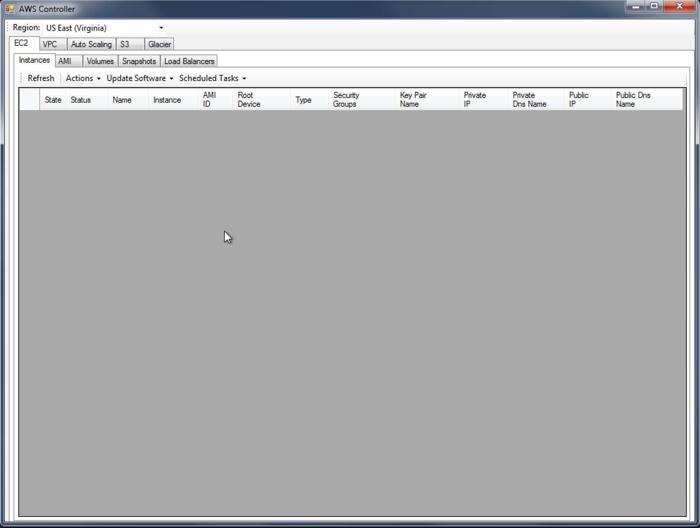
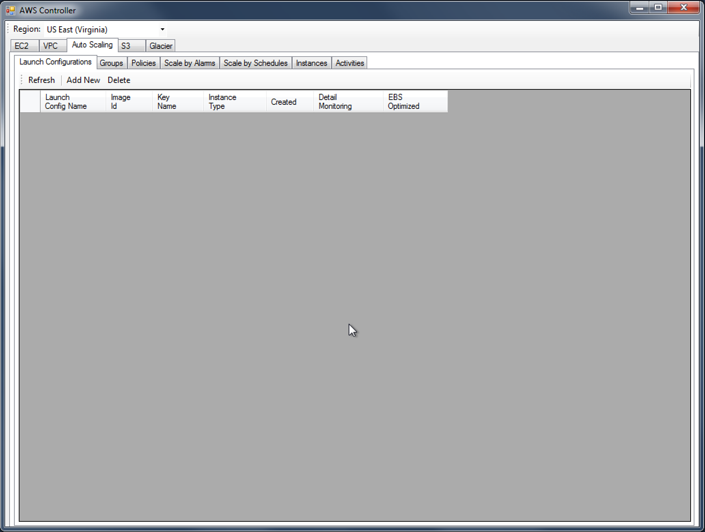
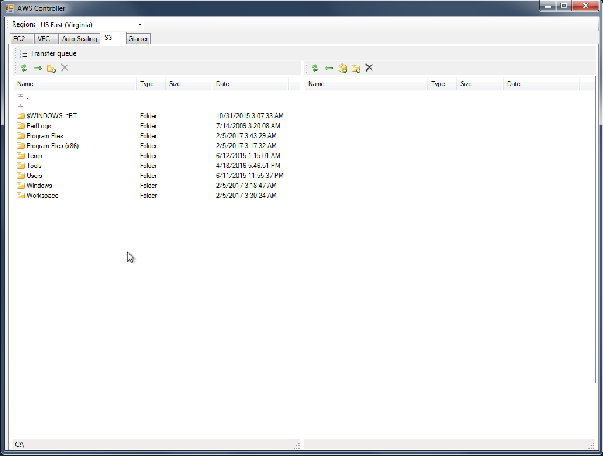
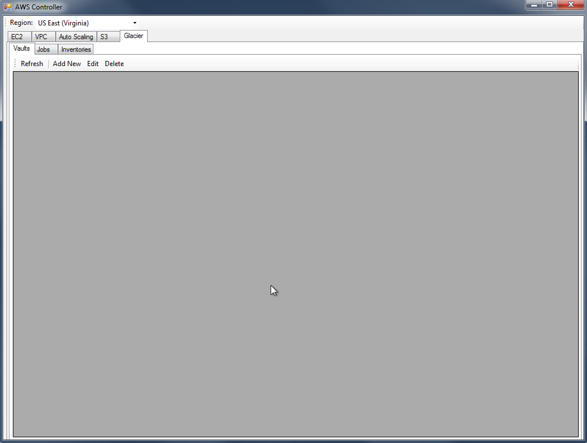

AwsController is a Windows Forms utility to manage Amazon AWS EC2 instances, VPC, Auto Scaling, Load Balancers, S3 and Glacier. Written in C# and requires .NET 4.x

## Features
- EC2: start/stop/terminate instance; backup instance; create image from instance
- Auto Scaling: create launch configurations, auto scaling groups, policies, scale by alarms/schedules
- S3: transfer/sync files between local folders and S3
- Glacier: add/edit/delete Glacier vault/jobs/inventories

## Usage
- Requires Visual Studio 2012 and up for development
- Edit app.config and update the values for AWSAccessKey and AWSSecretKey before using

## Screenshots

